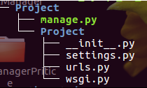

# 创建Django项目基本步骤

整体结构为 一个项目包含多个应用，一个应用对应一个业务模块

#### 创建项目
先cd到要创建项目的路径下
```
django-admin startproject 项目名称
```
例: 
```
django-admin startproject Project
```
<br>



- 子级Project是与项目同名的文件，包含如下内容
- \__init__.py 是表示文件Project可以被作为包使用
- settings.py 是项目的整体配置文件
- urls.py 是项目的URL配置文件
- wsgi.py 是项目与WSGI兼容的Web服务器入口

manage.py 是项目运行的入口，指定配置文件路径

#### 创建应用
```
python manage.py startapp 应用名
```
例
``` 
python manage.py startapp APP
```
<br>


- admin.py 是后台的站点管理注册文件
- \__init__.py 是表示文件Book可以被当作包使用
- migrations 是做模型迁移的
- models.py 是处理数据的   MVT中的M
- test.py 是做测试用的
- views.py 是处理业务逻辑的   MVT中的V

